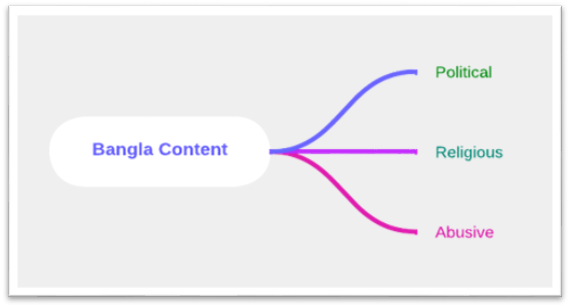

# SAFE READ: Bangla Content Classification & Recommendation System

**A keyword-based classification system for political, religious, and abusive Bangla content, with recommendations based on age-appropriateness.**

##  Project Overview

The widespread availability of Bangla text content raises concerns over exposing minors to inappropriate material. To address this, **SAFE READ** classifies input text based on keyword-matching into three categories:
-  Religious
-  Political
-  Abusive
  
 

 The system then recommends whether the content is suitable for all ages, specific age groups, or adults only.

## Features

-  Keyword-based classification using unigram, bigram, and trigram matching.
-  Recommender logic based on abusive and political keyword frequency.
-  User-friendly **Streamlit** web interface.
-  Efficient Bangla PDF-to-text conversion using `pdf2image` + OCR threading.
-  Built-in dataset and private abusive dictionary.

##  System Workflow

# Dataset Preparation

# Design Overview

# App All Pages

## Attraction
-Have created a dataset with my project partner. -Have a political ,religious and Abusive words dictnary. -has the ability to classify contents. -Can extarct text from bangla pdf.

## Technologies
- Python
- Streamlit
- Bangla NLP text preprocessing tools.

 ## Installation
 1. Clone the repository: https://github.com/afrintulii/SafeRead-System_Project_19.git
 2. Open the project in colab.
 3. Load the datasets and you are good to go.

 ## Usage
 1. Launch the application.
 2. Navigate through the user interface to access various features.

## Future Improvements
1. Expand dataset and include sentence-level context.
2. Use embedding techniques (TF-IDF, Word2Vec).
3. Improve stemmer for Bangla language.
4. Integrate LSTM or Transformer-based models for context-aware classification
    

